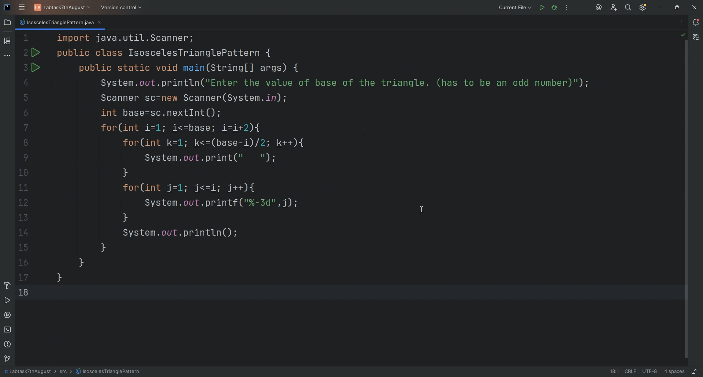

# CenteredIsoscelesTrianglePattern

A simple Java console application that prints a centered isosceles triangle pattern with numbers.  
The base length of the triangle must be an odd number, and the program centers the triangle accordingly.

## Features

- Takes an odd number input for the base of the triangle
- Prints numbers in each row starting from 1 up to the row width
- Properly centers the triangle in the console using spaces
- 🎥 Demo Output

*This simple Java program prints a Centered IsoscelesTriangle of numbers.*

## How to Run

1. Clone this repository:
git clone https://github.com/AtikHD/CenteredIsoscelesTrianglePattern.git
2. Navigate to the project directory:
4. Run the program:
